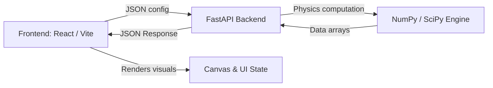

<p align="center">
  
  
  
  
  
  
</p>

<h1 align="center">📡 Beamforming Simulator</h1>

<p align="center">
  <b>A multi-domain, real-time phased-array beamforming simulator</b><br/>
  <sub>Ultrasound · 5G Communications · Radar Tracking · Doppler Blood-Vessel · DAS vs MVDR</sub>
</p>

---

## 🌟 Overview

**Beamforming Simulator** is a comprehensive, interactive web application for exploring the physics of **phased-array beamforming** across five distinct domains. All wave physics, signal processing, and array computations are performed on a Python/NumPy backend, while the React frontend delivers premium real-time visualizations at 60 FPS.

| Domain | Description |
|:---|:---|
| **⚕️ Ultrasound** | Acoustic imaging — waves, delays, interference, and geometry |
| **📶 5G Communications** | Multi-tower beam steering, handoff, connection tracking |
| **🎯 Radar Tracking** | 360° phased sweep, 5-target detection & auto-sizing |
| **🩸 Doppler** | Blood-vessel simulation, color overlay, cardiac waveform, audio sonification |
| **⚡ Advanced (DAS vs MVDR)** | Classical vs adaptive beamforming comparison under noise/interference |

---

## 🏗️ Architecture

The project enforces a **strict separation** between computation and presentation. **Zero physics calculations happen in the browser.**

```
┌─────────────────┐     JSON POST/Response     ┌──────────────────────┐
│  React Frontend │ ◄──────────────────────────► │  FastAPI Backend     │
│  (Vite + React) │     fetch('/api/...')        │  (Python + NumPy)    │
│                 │                              │                      │
│  • Canvas render│                              │  • Array factor math │
│  • Slider UI    │                              │  • Radar equation    │
│  • Animation    │                              │  • Beam steering     │
│    loop (rAF)   │                              │  • Signal processing │
└─────────────────┘                              └──────────────────────┘
```



---

## 📁 Project Structure

```
beamforming-simulator/
├── frontend/src/
│   ├── modes/
│   │   ├── ultrasound/         ← Member 1: Ultrasound Imaging
│   │   ├── 5g/                 ← Member 2: 5G Beam Steering
│   │   ├── radar/              ← Member 3: Radar PPI + Detection
│   │   │   ├── RadarMode.jsx       Main 3-column layout (sidebar + PPI + readouts)
│   │   │   ├── simulator.js        Animation loop & API communication
│   │   │   ├── renderer.js         PPI display (phosphor trail) + Polar pattern
│   │   │   └── ui.js               Format helpers (frequency, range, dBm, RCS)
│   │   └── m3_radar/           ← Member 3: Spec-named aliases
│   │       ├── RadarView.jsx       Re-export of RadarMode
│   │       └── radar_api.js        Typed fetch wrappers (/tick, /pattern, /lock-size)
│   ├── advanced/               ← Member 4: DAS vs MVDR panel
│   ├── components/             ← Shared UI components
│   ├── engine/                 ← Shared: apiClient, scenario loader, multi-array
│   ├── scenarios/              ← Predefined scenario JSON files
│   ├── App.jsx                 ← Tab shell (Ultrasound | 5G | Radar | Doppler | Advanced)
│   └── index.css               ← Premium dark theme design system
│
├── backend/
│   ├── physics/
│   │   ├── ultrasound/         ← Member 1: Waves, delays, geometry
│   │   ├── fiveg/              ← Member 2: Antenna, beam steering, signal, connection
│   │   ├── radar/              ← Member 3: Array factor, sweep, detection, radar eq.
│   │   │   ├── __init__.py         Public API re-exports
│   │   │   ├── array_factor.py     Element delays, grating lobe, SLL
│   │   │   ├── beam_sweep.py       BeamSweeper (continuous / bounce / sector)
│   │   │   ├── detection.py        360° gain profile, target illumination check
│   │   │   └── radar_equation.py   Received power, threshold, is_detected
│   │   └── advanced/           ← Member 4: DAS, MVDR, comparison
│   ├── m3_radar/               ← Member 3: Spec-named aliases
│   │   ├── router.py               Re-export of routes/radar router
│   │   ├── phased_logic.py          Re-export of physics/radar modules
│   │   └── sizing_logic.py          Lock-and-Size: wide→narrow auto-sizing
│   ├── models/                 ← Pydantic schemas (one per mode)
│   │   └── radar.py                RadarTickRequest/Response, LockSizeRequest/Response
│   └── routes/                 ← FastAPI endpoint routers (one per mode)
│       └── radar.py                POST /tick, /pattern, /delays, /lock-size
│
└── docs/                       ← Per-member documentation
    ├── member1_ultrasound.md
    ├── member2_5g.md
    ├── member3_radar_v2.md
    └── member4_shell_and_integration.md
```

---

## 🎯 Member 3: Radar Sandbox — Feature Details

### 360° Phased Sweep (Electronic Steering)

The radar performs a **fully electronic** 360° scan — no mechanical rotation. The beam is steered by computing per-element time delays:

```
τₙ = n · d · sin(θ₀) / c
```

Three sweep modes are supported:
| Mode | Behaviour |
|------|-----------|
| **Continuous 360°** | Wraps at ±180°, full circular scan |
| **Bounce** | Reverses direction at sector boundaries |
| **Sector** | Sweeps between configurable min/max angles |

### 5-Target Detection & Sizing

- **Click the PPI** to place up to 5 targets anywhere on the radar display
- Each target has a configurable **Radar Cross-Section (RCS)** from 0.1 to 100 m²
- Detection uses the **Radar Range Equation**:

```
Pᵣ = (Pₜ · G² · λ² · σ) / ((4π)³ · R⁴)
```

### 🔒 Lock-and-Size (Auto-Narrowing)

When a target is detected **consecutively** (≥2 sweep passes), the system automatically:
1. **Locks** onto the target (visual 🔒 badge appears)
2. **Narrows the beam** by 3× (conceptually increasing effective array elements)
3. **Estimates target angular size** (point / small / medium / large)
4. **Reports narrow beam width** and recommended sizing scan sector

### 7 Configurable Parameters

| # | Parameter | Range | Description |
|---|-----------|-------|-------------|
| 1 | **Elements (N)** | 4 – 128 | Number of antenna elements |
| 2 | **Spacing (d)** | 0.005 – 0.05 m | Inter-element spacing |
| 3 | **Pulse Frequency** | 1 – 24 GHz | Carrier / pulse frequency |
| 4 | **Sweep Speed** | 5 – 360 °/s | Angular velocity of scan |
| 5 | **Detection Threshold** | 0 – 1 | Sensitivity (0 = −130 dBm, 1 = −70 dBm) |
| 6 | **Local SNR** | 0 – 1000 | Signal-to-noise ratio for gain profile |
| 7 | **Local Windowing** | Rectangular, Hamming, Hanning, Blackman, Kaiser, Chebyshev, Taylor | Apodization window type |

### PPI Display (Plan Position Indicator)

- Classic **phosphor-trail** radar screen with configurable fade rate
- **Range rings** with metre labels (5 concentric rings)
- **Azimuth lines** every 30° with degree labels
- **Real-time beam lobe** visualization (filled polygon from gain profile)
- **Sweep line** with gradient glow effect
- **Target blips** with glow — bright when detected, fading with age
- **Array element** visualization at origin with delay-coloured ticks

### Polar Beam Pattern

- Live **polar gain curve** showing the full 360° pattern
- **Reference rings** at 0.25, 0.5, 0.75, 1.0 normalised gain
- **Current angle marker** overlaid on the pattern

### Readout Panel

Real-time telemetry displayed in the right panel:
- Sweep Angle (°)
- Beam Width / HPBW (°)
- Side-Lobe Level (dB)
- Active Target count
- Detection count
- ⚠️ **Grating Lobe Warning** when `d/λ > 1/(1 + |sin θ₀|)`

### Detection Log

Timestamped log of all detections with:
- Target ID
- Bearing angle
- Range
- Received power (dBm)
- Status highlighting (newest entries in cyan)

### Compare Mode

Side-by-side **Phased Array vs Rotating Line** display:
- Same targets rendered on both canvases simultaneously
- Demonstrates beam-forming advantage over simple rotating scan

### Scenario System

- **Load Air Defense Scenario** — preloaded 5-target scenario
- Configurable via JSON files in `frontend/src/scenarios/`

---

## 📸 Screenshots

| ⚕️ Ultrasound Simulator | 📶 5G Beamforming |
| :---: | :---: |
|  |  |

| 🎯 Radar Tracking (PPI) | 🩸 Doppler & Advanced |
| :---: | :---: |
|  |  |

> 📌 *Replace placeholder paths with actual screenshots.*

---

## 🛠️ Technology Stack

### Frontend
| Technology | Purpose |
|:---|:---|
| **React 18** | Component architecture (Hooks, functional components) |
| **Vite 5** | Dev server & build tool |
| **Canvas 2D API** | PPI display, beam pattern, phosphor effects |
| **Vanilla CSS** | Premium dark theme with CSS custom properties |

### Backend
| Technology | Purpose |
|:---|:---|
| **Python 3.9+** | Core runtime |
| **FastAPI 0.109** | REST API framework with auto-generated docs |
| **Uvicorn** | ASGI server (auto-reload in development) |
| **NumPy 1.26** | High-performance array & matrix operations |
| **Pydantic 2.6** | Request/response validation and serialisation |

---

## 🚀 Getting Started

### Prerequisites

- **Python 3.9+** with `pip`
- **Node.js 18+** with `npm`
- **Git**

### 1. Clone the Repository

```bash
git clone <your-repo-url>
cd beamforming-simulator
```

### 2. Backend Setup
```bash
uvicorn backend.main:app --reload
```

Or
```bash
cd backend

# Create and activate virtual environment
python -m venv venv

# Windows:
venv\Scripts\activate
# macOS/Linux:
# source venv/bin/activate

# Install dependencies
pip install -r requirements.txt

# Start the server (auto-reload enabled)
uvicorn main:app --reload --port 8000
```

The API is now live at **[http://localhost:8000](http://localhost:8000)**  
Interactive Swagger docs: **[http://localhost:8000/docs](http://localhost:8000/docs)**

### 3. Frontend Setup

Open a **new terminal** from the project root:

```bash
cd frontend

# Install dependencies
npm install

# Start the dev server
npm run dev
```

The app is now live at **[http://localhost:5173](http://localhost:5173)**

---

## 🔌 API Endpoints

### Radar Endpoints (`/api/radar`)

| Method | Endpoint | Description |
|--------|----------|-------------|
| `POST` | `/api/radar/tick` | Advance simulation by one frame (sweep, detect, compute) |
| `POST` | `/api/radar/pattern` | Get beam pattern snapshot at given angle (no sweep advance) |
| `POST` | `/api/radar/delays` | Get per-element time delays for given configuration |
| `POST` | `/api/radar/lock-size` | Evaluate targets for Lock-and-Size auto-narrowing |

### Other Mode Endpoints

| Prefix | Mode | Owner |
|--------|------|-------|
| `/api/5g` | 5G Beamforming | Member 2 |
| `/api/doppler` | Doppler Blood-Vessel | Member 4 |
| `/api/advanced` | DAS vs MVDR Comparison | Member 4 |
| `/api/ultrasound` | Ultrasound Imaging | Member 1 (placeholder) |

---

## 🧪 Key Physics Equations

### Array Factor (Beam Pattern)

$$AF(\theta) = \frac{1}{N} \left| \sum_{n=0}^{N-1} w_n \cdot e^{j \cdot n \cdot \frac{2\pi d}{\lambda} (\sin\theta - \sin\theta_0)} \right|$$

Where:
- `N` = number of elements
- `d` = element spacing (m)
- `λ` = wavelength (m)
- `θ₀` = steering angle
- `wₙ` = apodization weights

### Radar Range Equation

$$P_r = \frac{P_t \cdot G^2 \cdot \lambda^2 \cdot \sigma}{(4\pi)^3 \cdot R^4}$$

Where:
- `Pₜ` = transmit power (W)
- `G` = array gain (≈ N for ULA)
- `σ` = radar cross-section (m²)
- `R` = range to target (m)

### Grating Lobe Condition

$$\frac{d}{\lambda} > \frac{1}{1 + |\sin\theta_0|}$$

When this condition is true, a grating lobe appears → **warning displayed** in the UI.

### Beam Width (HPBW)

$$\theta_{3dB} \approx \frac{0.886 \cdot \lambda}{N \cdot d}$$

---

## 👨‍💻 Team & Member Documentation

| Member | Domain | Documentation |
|--------|--------|--------------|
| **Member 1** | Ultrasound Imaging | [docs/member1_ultrasound.md](docs/member1_ultrasound.md) |
| **Member 2** | 5G Beam Steering | [docs/member2_5g.md](docs/member2_5g.md) |
| **Member 3** | Radar Sweeps & Detection | [docs/member3_radar_v2.md](docs/member3_radar_v2.md) |
| **Member 4** | Doppler, Shell & DAS/MVDR | [docs/member4_shell_and_integration.md](docs/member4_shell_and_integration.md) |

---

## 📋 Member 3 Deliverable Checklist

- [x] **Backend Physics Engine** — Array factor, element delays, grating lobe, SLL
- [x] **Beam Sweep Engine** — BeamSweeper with continuous / bounce / sector modes
- [x] **Radar Range Equation** — Received power, detection threshold, is_detected
- [x] **Detection Logic** — 360° gain profile, target illumination, confidence scoring
- [x] **Lock-and-Size Logic** — Wide-beam detection → auto-narrow → target sizing
- [x] **Pydantic Models** — Full request/response schemas for all 4 endpoints
- [x] **FastAPI Router** — `/tick`, `/pattern`, `/delays`, `/lock-size`
- [x] **PPI Renderer** — Phosphor trail, range rings, azimuth lines, beam lobe, targets
- [x] **Polar Pattern Renderer** — Full gain curve with angle overlay
- [x] **RadarMode UI** — 3-column layout, 7 param sliders, scan/sweep toggles
- [x] **Target Spawner** — Click-to-place (max 5), per-target RCS slider, remove
- [x] **Detection Log** — Timestamped entries with power readings
- [x] **Compare Mode** — Side-by-side Phased Array vs Rotating Line
- [x] **Scenario Support** — Load Air Defense scenario from JSON
- [x] **7 Parameters** — Elements, Spacing, Pulse Frequency, Sweep Speed, Threshold, Local SNR, Local Windowing
- [x] **Spec Alias Files** — `m3_radar/` directory with router, phased_logic, sizing_logic, RadarView, radar_api

---

## 📜 License

See [LICENSE](./LICENSE) for details.
