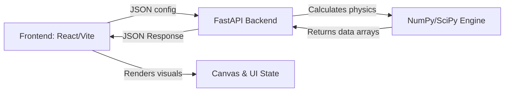

# 📡 Beamforming Simulator
## Architecture
- **Frontend:** React 18 + Vite (rendering & UI only — zero physics math)
- **Backend:** FastAPI (ALL physics, math, and computation)

## Structure
```
beamforming-simulator/
├── frontend/src/
│   ├── modes/ultrasound/   ← Member 1 (renderer, simulator, UI)
│   ├── modes/5g/           ← Member 2 (renderer, simulator, UI)
│   ├── modes/radar/        ← Member 3 (renderer, simulator, UI)
│   ├── components/         ← Member 4 (shared UI components)
│   ├── engine/             ← Member 4 (apiClient, scenario, multi-array)
│   └── advanced/           ← Member 4 (AI vs Classical panel)
└── backend/
    ├── physics/ultrasound/ ← Member 1 (waves, delays, interference, geometry)
    ├── physics/fiveg/      ← Member 2 (antenna, beam steering, signal, connection)
    ├── physics/radar/      ← Member 3 (array factor, sweep, detection, radar eq.)
    ├── physics/advanced/   ← Member 4 (DAS, MVDR, comparison)
    ├── models/             ← Pydantic schemas (one per mode)
    └── routes/             ← FastAPI endpoints (one per mode)
```
A comprehensive, interactive web-based simulator designed to explore the principles of **Beamforming** across multiple domains: Ultrasound, 5G Communications, Radar, and Doppler Effect. It also features a dedicated module for comparing classical Delay-and-Sum (DAS) beamforming against advanced Minimum Variance Distortionless Response (MVDR).

 <!-- Add your main banner or screenshot here -->

## 🚀 Features

### Multi-Domain Simulation Platform
1. **⚕️ Ultrasound Imaging:** Simulate acoustic waves, delays, interference, and geometry for medical imaging applications.
2. **📶 5G Communications:** Explore antenna arrays, beam steering, signal propagation, and connection tracking for modern networks.
3. **🛰️ Radar Systems:** Visualize array factors, sweeps, object detection, and the radar equation in real-time.
4. **🩸 Doppler Blood-Vessel Simulator:** Interactive color Doppler overlay, pulsatile cardiac waveform visualization, real-time auditory feedback (sonification), and vessel preset configurations.
5. **🧠 Advanced Beamforming (DAS vs. MVDR):** A dedicated research panel to directly compare and evaluate the performance of classical vs. adaptive beamforming algorithms under varying noise and interference conditions.

## 📸 Screenshots

| ⚕️ Ultrasound Simulator | 📶 5G Beamforming |
| :---: | :---: |
|  <!-- Replace with actual screenshot --> |  <!-- Replace with actual screenshot --> |

| 🛰️ Radar Tracking | 🩸 Doppler & Advanced |
| :---: | :---: |
|  <!-- Replace with actual screenshot --> |  <!-- Replace with actual screenshot --> |

## 🏗️ System Architecture

The project is strictly separated into a computation-heavy backend and a highly responsive React frontend. **Zero physics calculations happen in the browser.**

- **Frontend:** React 18 + Vite. Focuses on rendering, user interface component state, and configuration menus.
- **Backend:** Python + FastAPI + NumPy. Handles all wave physics, array processing, phase delays, interference computations, and signal processing.



## 🛠️ Technology Stack

**Frontend:**
- **React 18** (Hooks, functional components)
- **Vite** (Build tool and dev server)
- Vanilla CSS / CSS Modules for custom styling

**Backend:**
- **Python 3.9+**
- **FastAPI** (REST API framework)
- **Uvicorn** (ASGI server)
- **NumPy** (High-performance mathematical and matrix operations)
- **Pydantic** (Data validation and parsing)

## 🚦 Getting Started

### 1. Clone the Repository
```bash
git clone <your-repo-url>
cd beamforming-simulator
```

### 2. Backend Setup
Ensure you have Python installed. We recommend using a virtual environment.
```bash
cd backend
python -m venv venv

# On Windows:
venv\Scripts\activate
# On macOS/Linux:
# source venv/bin/activate

pip install -r requirements.txt
uvicorn main:app --reload --port 8000
```
The API should now be running at [http://localhost:8000](http://localhost:8000). You can view the interactive Swagger documentation at [http://localhost:8000/docs](http://localhost:8000/docs).

### 3. Frontend Setup
Ensure you have Node.js installed. Open a new terminal from the root folder.
```bash
cd frontend
npm install
npm run dev
```
The Frontend should now be running at [http://localhost:5173](http://localhost:5173).

## 👨‍💻 Team & Documentation

The project is structured around four distinct logic modules, each handled by a dedicated member:
*   [Member 1: Ultrasound Imaging Simulator](docs/MEMBER1_ULTRASOUND.md)
*   [Member 2: 5G Beam Steering Physics](docs/MEMBER2_5G.md)
*   [Member 3: Radar Sweeps & Detection](docs/MEMBER3_RADAR.md)
*   [Member 4: Doppler Mode & Advanced DAS/MVDR](docs/MEMBER4_SHELL.md)

---
**License:** See `LICENSE` file for more information.
